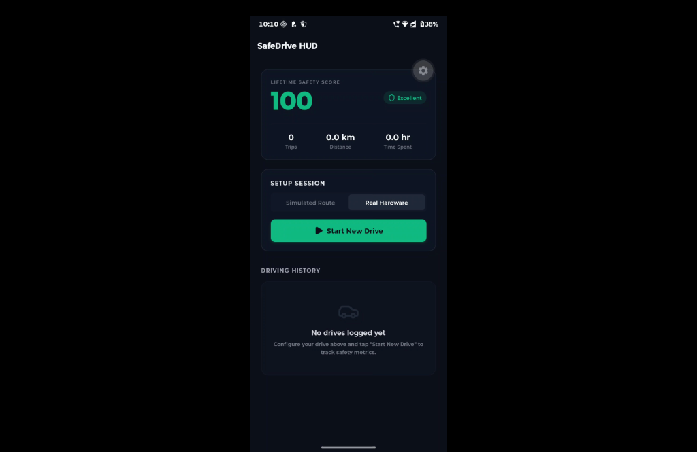
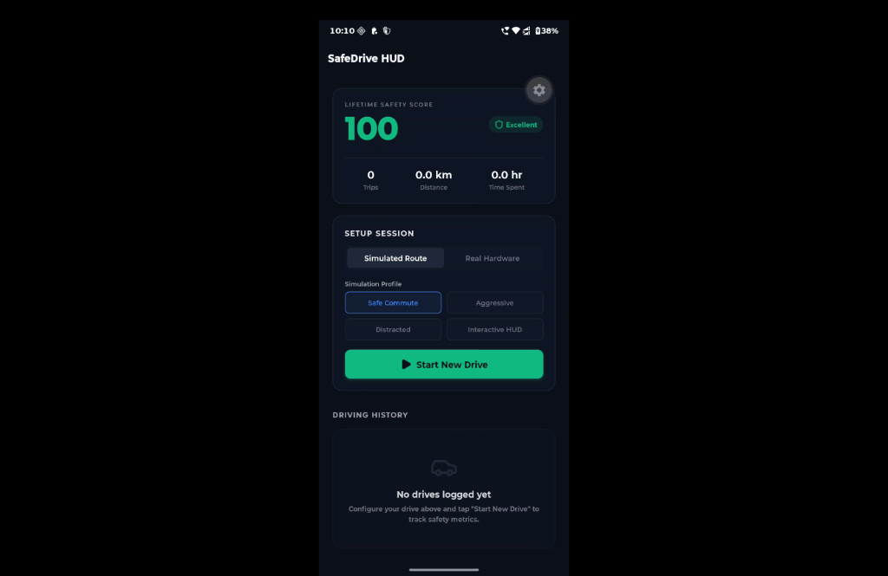
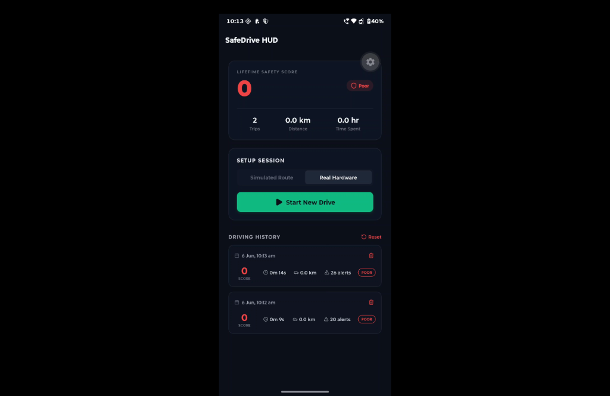
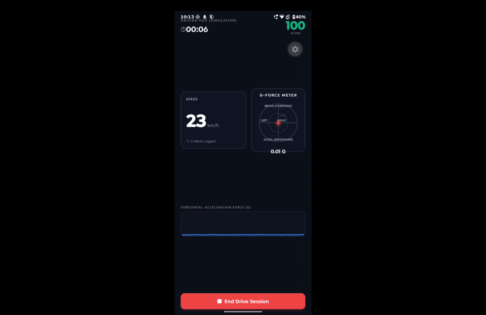
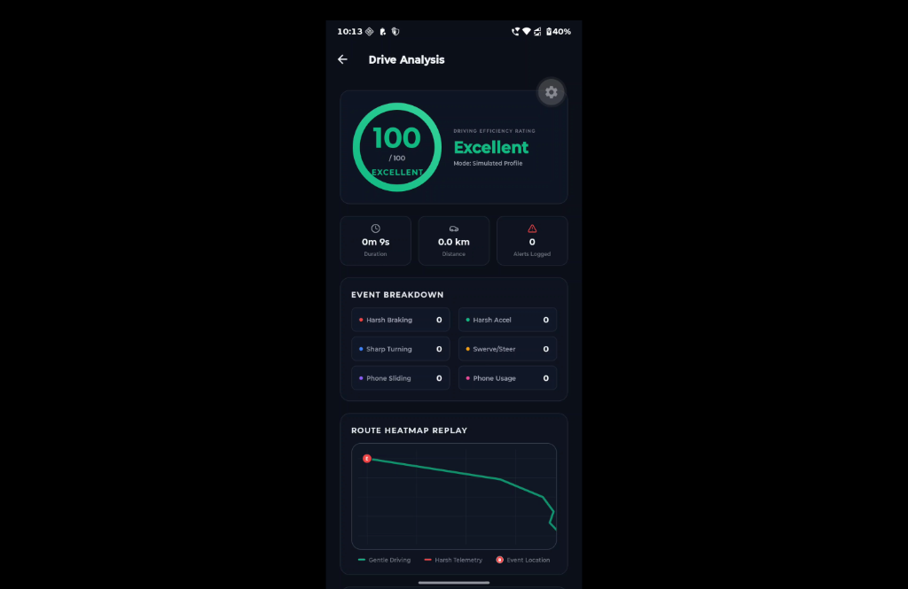
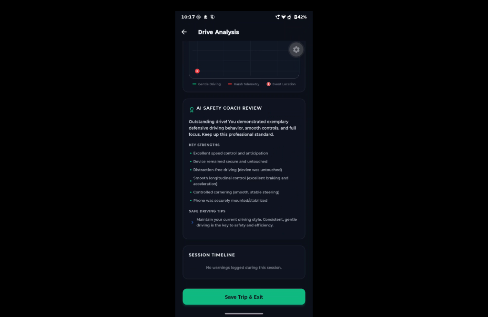

# SafeDrive HUD

SafeDrive HUD is a mobile application built using Expo (SDK 55) and React Native that leverages device sensors to analyze driving behaviors in real-time. The application detects high-risk actions such as harsh braking, sudden acceleration, sharp cornering, aggressive steering, device instability, and phone handling. It calculates a safety score out of 100 and provides visual and audio feedback, historical tracking, and an interactive route replay heatmap.

To facilitate testing on simulators and web browsers where physical sensors are unavailable, the application features an integrated kinematic vehicle simulator with preconfigured route profiles and manual event injection capabilities.

---

## Features

- **Real-Time Sensor Processing**: Filters noise and extracts linear acceleration vectors from device accelerometer, gyroscope, and motion APIs.
- **Drive HUD Telemetry**: Displays real-time speed, elapsed drive duration, alert warnings, a visual G-force bullseye bubble, and a rolling G-force telemetry chart.
- **Safety Score Calculator**: Commences at 100 points, applying weighted deductions per unsafe event.
- **Interactive Route Replay**:normalized vector map illustrating the driving route, colored dynamically by telemetry safety levels, showing pinpointed event markers.
- **AI-Style Driving Coach**: Aggregates telemetry stats at the end of a drive, outputting safe driving verdicts, strengths, and recommendations.
- **Drive Simulation Mode**: Streams mock telemetry simulating safe driving, aggressive driving, or distracted driving, plus custom HUD mode with manual event injection buttons.
- **Persistent Local History**: Saves drive logs to AsyncStorage, sorting by date descending, with individual record deletions or complete database resets.

---

## Event Detection Thresholds

| Event | Primary Sensor | Trigger Threshold | Score Deduction | Description |
| :--- | :--- | :--- | :--- | :--- |
| Harsh Acceleration | Accelerometer (Y-Axis) | >= 2.8 m/s^2 (0.28G) for 500ms | -5 points | Abrupt forward acceleration. |
| Harsh Braking | Accelerometer (Y-Axis) | <= -3.2 m/s^2 (-0.32G) for 500ms | -5 points | Sudden backward deceleration. |
| Sharp Turn | Gyroscope (Z-Axis) + Accel (X-Axis) | >= 0.65 rad/s yaw rate AND >= 3.0 m/s^2 lateral force | -3 points | High-speed lateral cornering. |
| Aggressive Steering | Accelerometer (X-Axis Jerk) | >= 6.5 m/s^3 lateral derivative | -4 points | Sudden lane changes or weaving. |
| Excessive Movement | Accelerometer (Variance) | >= 2.2 variance on linear magnitude | -2 points | Device shaking or sliding. |
| Phone Handling | Gyroscope (XY Magnitude) | >= 1.2 rad/s roll/pitch rate | -10 points | Device tilt indicating pickup. |

*Note: A 3-second cooldown is enforced per event type to prevent double-triggering for single maneuvers.*

---

## Screenshots

### Dashboard Screens

| Initial State | Simulation Configuration | History Log |
| :---: | :---: | :---: |
|  |  |  |

### Active HUD & Analysis Summary

| Active Telemetry HUD | Session Summary Analysis | AI Coaching Review |
| :---: | :---: | :---: |
|  |  |  |

---

## Getting Started

### Prerequisites

You need Node.js and Bun (or npm) installed on your development machine.

### Installation

1. Clone the repository:
   ```bash
   git clone git@github.com:crazy-titan/React-SafeDrive.git
   cd React-SafeDrive
   ```

2. Install dependencies:
   ```bash
   bun install
   ```

3. Start the Expo development server:
   ```bash
   npx expo start
   ```

Use the Expo Go application on an Android or iOS device to scan the generated QR code and test the application, or press `w` to run on a web browser.
